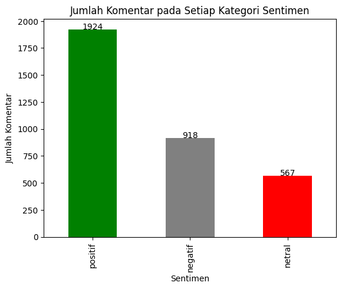
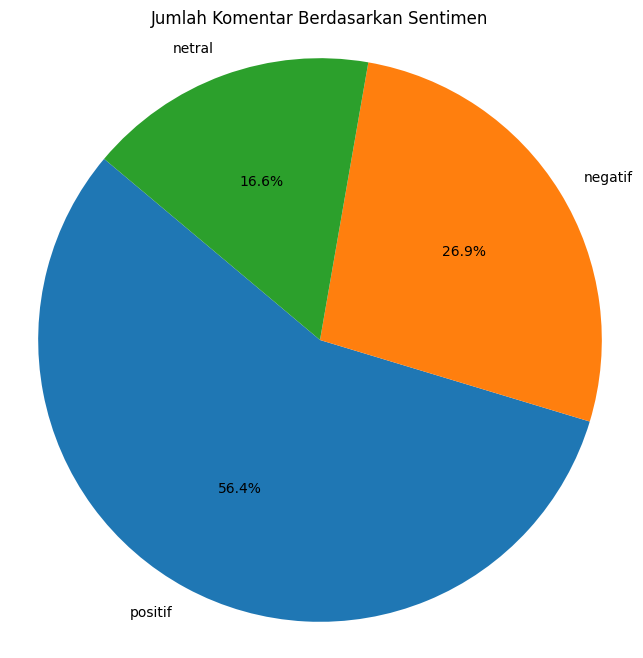
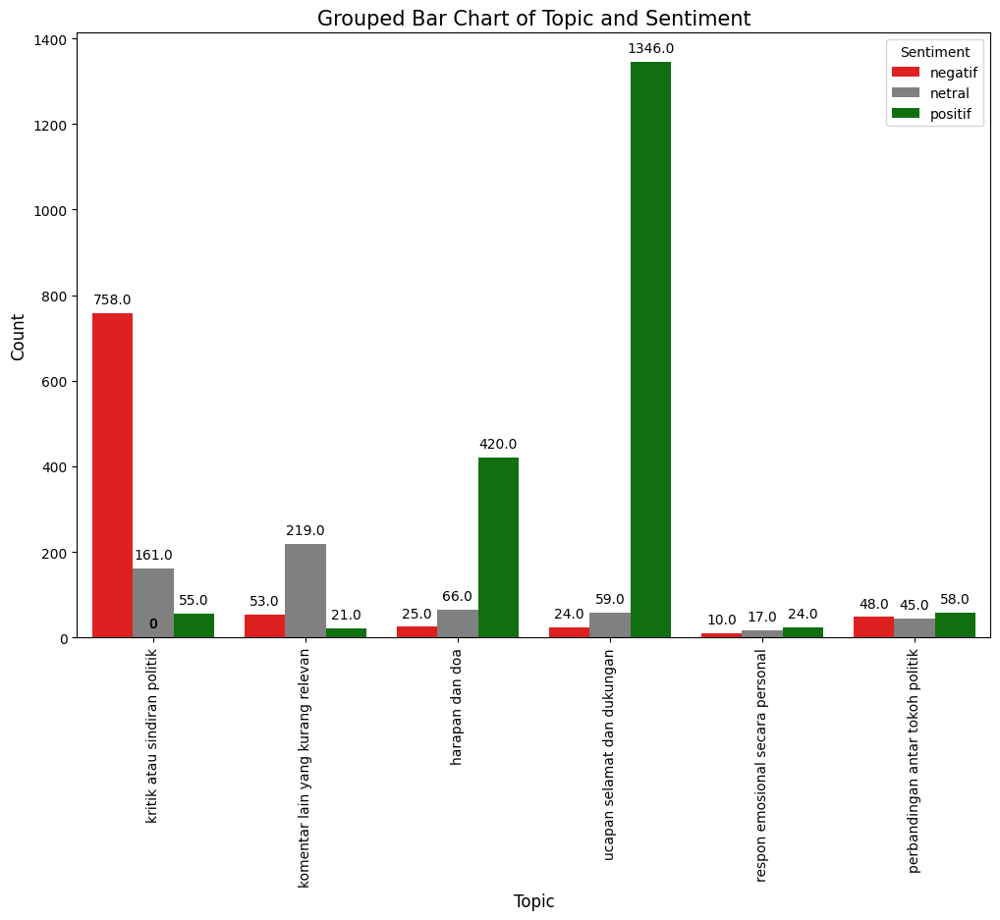
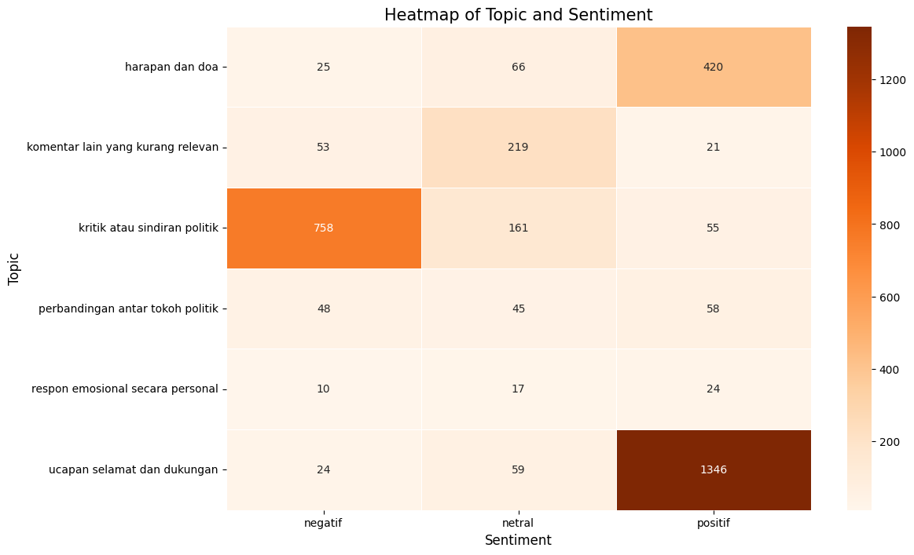
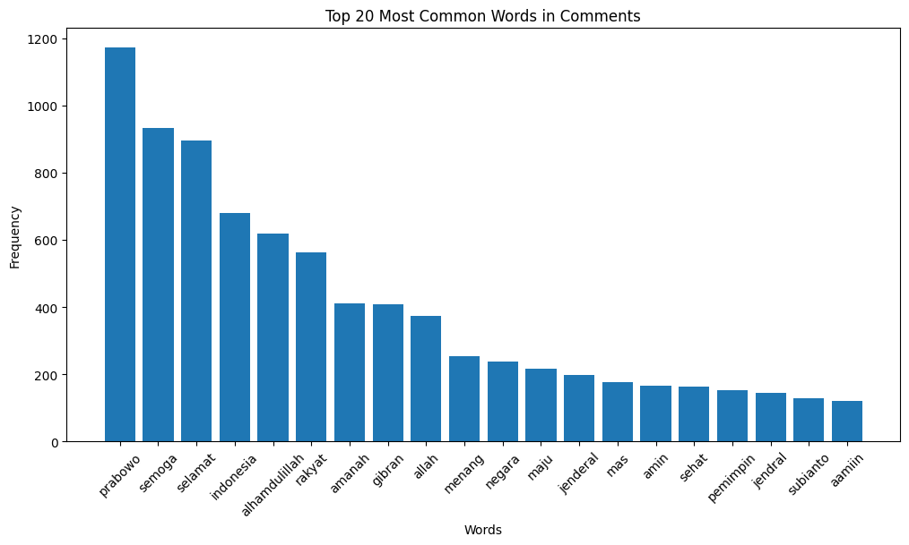
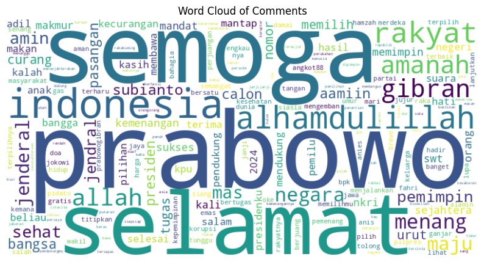

# 🧠 _Capstone Project: Decoding Public Sentiment_
## _AI-Driven Analysis_ Komentar YouTube Pidato Pertama Prabowo Subianto Pasca Menang Pilpres Indonesia Tahun 2024
### Dengan NLP Berbasis LLM (GPT-3.5-turbo)

---

### 👤 _Author & Contact_  
- **Nama**         : Maulana Diki Wicaksono
- **NIM**          : 23031030001
- **Universitas**  : Universitas Negeri Yogyakarta  
- **Email**        : maulanadiki963@gmail.com  
- **GitHub**       : [github.com/Lanaaa1234](https://github.com/Lanaaa1234)  
- **LinkedIn**     : [linkedin.com/in/maulana-diki-wicaksono](https://www.linkedin.com/in/maulana-diki-wicaksono/)  
- **Instagram**:   : [@maulanadikii_24](https://www.instagram.com/maulanadikii_24/)  

---

## 📌 _1. Project Overview_  
**Latar Belakang & Masalah**  
Setelah KPU menetapkan Prabowo Subianto sebagai Presiden RI 2024–2029, pidato pertamanya di kanal youtube KOMPASTV memicu ribuan komentar publik. Komentar ini mencerminkan opini, emosi, dan sikap politik masyarakat Indonesia yang penting untuk dianalisis guna memahami persepsi publik.  

**Tujuan**  
- Mengolah komentar YouTube pidato Prabowo Subianto secara otomatis untuk **memahami opini publik**.
- Mengidentifikasi **sentimen** (positif, netral, negatif) dan mengelompokkan **topik pembahasan** dari komentar publik.
- Menyusun **ringkasan naratif** per topik pembahasan.
- Mendemonstrasikan peran **AI (GPT-3.5-turbo)** dalam menangani data teks bahasa Indonesia berskala besar secara efisien. 

---

## 🔗 2. Notebook & Dataset  
- 📒 **Google Colab Notebook**:  
  https://colab.research.google.com/drive/1-cFq7F3w-H_aA-5pnUkAiZUd_xAV-F16?usp=sharing  
- 📁 **Dataset & output (Google Drive)**:  
  https://drive.google.com/drive/folders/1zIb7QLEWGsypM1agrUuKQS5oO_yBqJuy?usp=sharing  
- 📽️ **Sumber Video YouTube**:  
  https://youtu.be/5DbCvqfg-9I?si=cLabiu4VVIFclz_2  

---

## ⚙️ _3. Methodology_ 
1. **_Data Collection (Scraping)_**  
   - YouTube Data API v3 → `komentar_prabowo.csv` (3.597 baris × 4 kolom)  
2. **_Data Cleaning & Emoji Removal_**  
   - Regex & Python → `komentar_prabowo_unemot.csv` (3.487 baris × 4 kolom)  
3. **Preprocessing Teks dengan LLM**  
   - GPT-3.5-turbo: normalisasi kata, perbaikan ejaan → `komentar_preprocess_gpt35.csv` (3.487 baris × 5 kolom)  
4. **_Sentiment Analysis (LLM)_**  
   - Klasifikasi positif/netral/negatif → `komentar_sentimen_gpt35.csv` (3.410 baris × 3 kolom)  
5. **_Topic Classification (LLM)_**  
   - 6 kategori topik yang dikodekan A–F → `komentar_topik_OKGPT35.csv`  
6. **Visualisasi**  
   - Bar chart, pie chart, grouped bar chart, heatmap, word cloud  
7. **_Summarization by Topic (LLM)_**  
   - Ringkasan naratif 1.000–3.000 karakter per topik → `ringkasan_topik_full.csv`  
8. **_Fun Fact & Word Frequency_**  
   - 20 kata teratas & word cloud  

---

## 📊 _4. Insight & Findings_  
- **Sentimen**: 56,4% positif, 26,9% negatif, 16,6% netral  
- **Topik Teratas**:   
  - A: ucapan selamat dan dukungan (1.429 komentar)  
  - C: kritik atau sindiran politik (974 komentar)
  - B: harapan dan doa (511 komentar)
- **Sekilas relasi Topik–Sentimen**:
  - topik komentar terkait ucapan selamat dan dukungan memiliki mayoritas sentimen positif yakni sejumlah 1.346 dari 1.429 komentar
  - topik komentar terkait kritik atau sindiran politik memiliki mayoritas sentimen negatif sejumlah 758 dari 974 komentar 
- **Word Cloud**: dominasi kata “prabowo”, “semoga”, “selamat”, “indonesia”

---
## 🤖 _5. AI Support Explanation_  
- 🧹 **_Preprocessing_**: GPT-3.5-turbo membersihkan & memperbaiki ejaan  
- 📊 **_Sentiment Analysis_**: klasifikasi komentar ke dalam 3 kategori (positif, netral, negatif) 
- 🧠 **_Topic Classification_**: pengelompokan ke kode A–F  
- 📚 **_Summarization_**: ringkasan naratif per topik & sentimen  
- 📈 **_Visual Code Generation_**: LLM bantu generate kode Python untuk grafik  

---

## 📝 _6. Conclusions_
## 🌟 Rekomendasi Pengembangan

1. **Pemanfaatan untuk Strategi Komunikasi Publik**  
   Analisis topik dan sentimen dapat dimanfaatkan untuk merancang pesan komunikasi yang lebih terarah dan memilih kanal distribusi yang sesuai, berdasarkan persebaran sentimen publik terhadap isu tertentu.

2. **Pengembangan Sistem Pemantauan Opini Real-Time**  
   Dapat dipertimbangkan integrasi sistem pemantauan otomatis berbasis scraping berkala dan dashboard interaktif (misalnya menggunakan Streamlit atau Plotly Dash) untuk:
   - Mendeteksi perubahan tren sentimen dan topik secara real-time  
   - Menghasilkan notifikasi ketika terjadi lonjakan komentar negatif pada isu tertentu

3. **Optimasi Pipeline dan Validasi Model**  
   - Tingkatkan akurasi pembersihan teks dengan penggunaan pustaka khusus (mis. `emoji`, `demojize`)
   - Modularisasi prompt dan penerapan batch processing untuk efisiensi waktu komputasi
   - Lakukan validasi hasil klasifikasi dengan pendekatan:
     - NLP tradisional (KNN, Naïve Bayes)
     - Verifikasi manual pada sampel data acak

4. **Pengayaan Analisis dan Ekspansi Cakupan**  
   - Visualisasikan dinamika sentimen dan topik dari waktu ke waktu (analisis temporal)
   - Tambahkan analisis emosi publik (senang, marah, sedih) menggunakan model lanjutan
   - Perluas cakupan data ke platform lain (Twitter, Facebook) untuk analisis lintas kanal

---

## 🌟 _7. Recommendations_

- **Pemanfaatan untuk Strategi Komunikasi Publik**  
  Hasil analisis topik dan sentimen dapat dijadikan landasan dalam merancang narasi komunikasi yang lebih terarah serta pemilihan kanal distribusi pesan yang sesuai, berdasarkan persebaran sentimen publik terhadap isu tertentu.

- **Pengembangan Sistem Pemantauan Opini Real-Time**  
  Implementasi sistem pemantauan secara otomatis, seperti melalui scraping terjadwal dan dashboard interaktif, berpotensi memberikan insight cepat terhadap perubahan persepsi publik. Fitur ini dapat memperingatkan apabila terjadi lonjakan sentimen negatif terhadap topik tertentu.

- **Optimasi Pipeline dan Validasi Model**  
  Proses pembersihan data dapat ditingkatkan dengan integrasi pustaka khusus untuk penanganan emoji dan simbol. Di sisi lain, modularisasi prompt dan penerapan batch processing dinilai dapat mengurangi waktu komputasi. Validasi hasil klasifikasi dengan metode NLP konvensional maupun peninjauan manual secara acak akan meningkatkan keandalan model.

- **Pengayaan Analisis dan Cakupan Platform**  
  Pengembangan lanjutan mencakup analisis temporal untuk melihat dinamika opini dari waktu ke waktu, serta deteksi intensitas sentimen dan emosi publik. Ekspansi ke platform lain seperti Twitter atau Facebook memungkinkan perbandingan persepsi lintas kanal media sosial.

---

## 📊 Lampiran Visualisasi Komentar YouTube

### a. Analisis Sentimen

### b. Distribusi Topik dan Sentimen

### c. Analisis Kata

